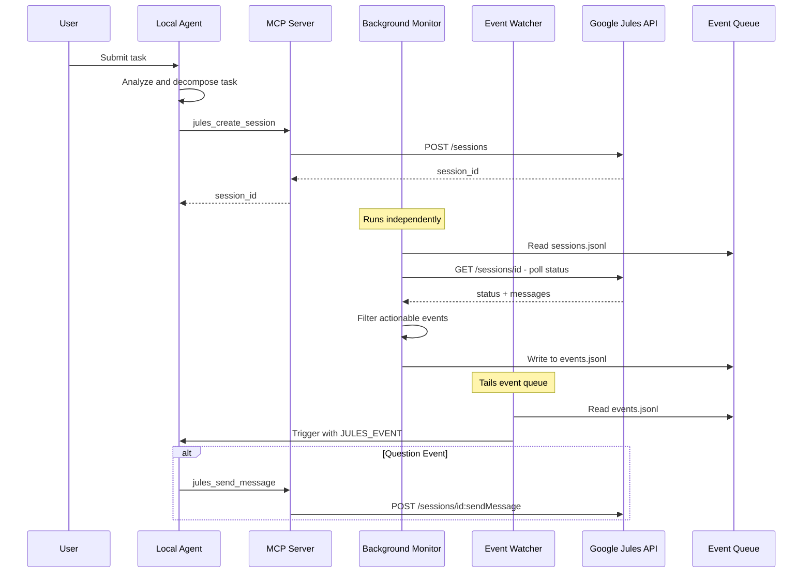
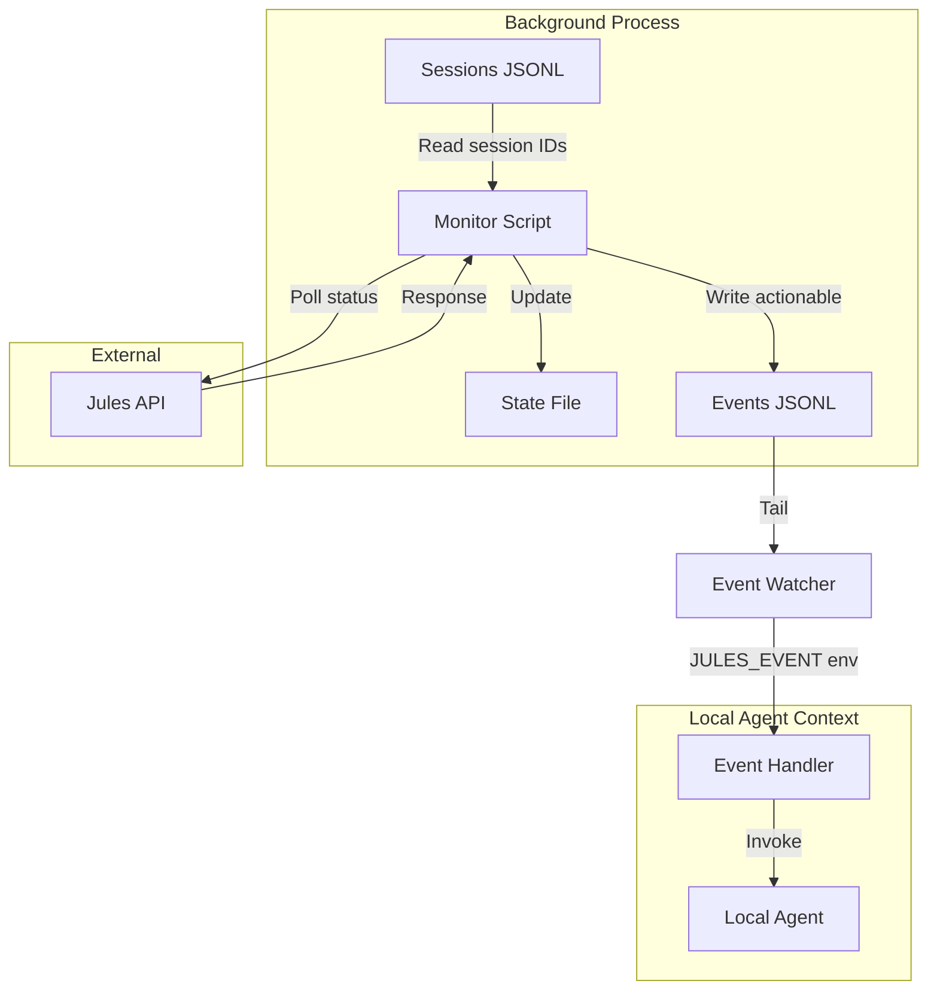
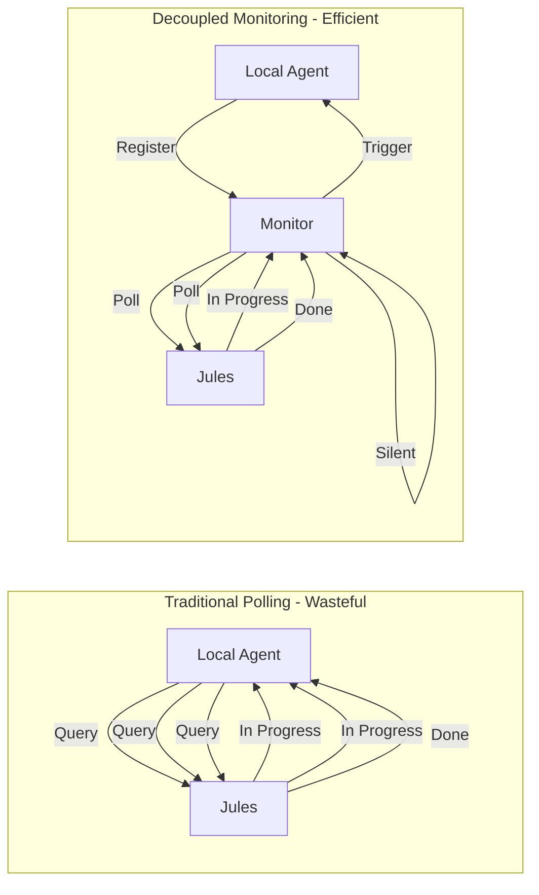

# Jules Manager - Architectural Design (TypeScript)

## Overview

An MCP server implementation for orchestrating Google Jules as a remote coding agent from a local coding agent. The system handles the full lifecycle: task decomposition, API-based dispatch to Jules, asynchronous status monitoring, intervention handling, code review, and PR merging.

**Core Constraint:** The local agent must not waste context window tokens on active polling. A decoupled monitoring mechanism handles polling independently and only triggers the local agent when human-level input or a final review is required.

---

## 1. Architectural Workflow

### Step-by-Step Interaction Loop



### Lifecycle Phases

| Phase | Description | Local Agent Action | Background Process |
|-------|-------------|------------|-------------------|
| 1. Intake | Receive user task | Analyze scope, success criteria | None |
| 2. Decomposition | Break into Jules-sized work | Create subtasks, define acceptance | None |
| 3. Dispatch | Create Jules sessions | Call MCP tools, register session IDs | None |
| 4. Monitoring | Track session progress | **Idle** | Poll Jules API, filter events |
| 5. Intervention | Handle questions/stuck | Respond via MCP, update prompts | Detect stuck states |
| 6. Review | Code review on completion | Fetch artifacts, run tests | None |
| 7. Merge | Merge PR after CI passes | Call merge API, cleanup | None |
| 8. Archive | Post-merge cleanup | Close session, update tracking | None |

---

## 2. MCP Server Strategy

### Custom MCP Server Specification

#### Server Identity
- **Name:** `jules-mcp`
- **Version:** `2.0.0`
- **Protocol Version:** `2024-11-05`
- **Transport:** stdio JSON-RPC

#### Tool Definitions

| Tool | Description | Parameters | Jules API Endpoint |
|------|-------------|------------|-------------------|
| `jules_create_session` | Create a new Jules session | owner, repo, branch, prompt | POST /sessions |
| `jules_get_session` | Fetch session metadata and status | session_id | GET /sessions/{id} |
| `jules_list_sessions` | List all sessions | pageSize, pageToken | GET /sessions |
| `jules_delete_session` | Delete a session | session_id | DELETE /sessions/{id} |
| `jules_send_message` | Send a message to Jules | session_id, message | POST /sessions/{id}:sendMessage |
| `jules_approve_plan` | Approve a pending plan | session_id | POST /sessions/{id}:approvePlan |
| `jules_list_activities` | List session activities | session_id, pageSize, pageToken | GET /sessions/{id}/activities |
| `jules_get_activity` | Get a single activity | session_id, activity_id | GET /sessions/{id}/activities/{id} |
| `jules_list_sources` | List connected repositories | pageSize, pageToken | GET /sources |
| `jules_get_source` | Get source details | source_id | GET /sources/{id} |
| `jules_extract_pr_from_session` | Extract PR details from completed session | session_id | GET /sessions/{id} |

#### Authentication
- Uses `JULES_API_TOKEN` environment variable
- Bearer token authentication in Authorization header
- Optional `JULES_API_BASE` for custom endpoints

---

## 3. Background Monitoring System

### Architecture



### Monitor Script Behavior

The monitor runs as an independent process with its own token budget:

1. **Read Sessions File:** Load active session IDs from `sessions.jsonl`
2. **Poll Jules API:** Query each session status at configured interval
3. **Track State:** Maintain cursor and last-known status per session
4. **Filter Events:** Only emit actionable events
5. **Write Events:** Append to `events.jsonl`

### Actionable Event Types

| Event Type | Trigger Condition | Data Included |
|------------|-------------------|---------------|
| `question` | Jules asks for clarification | session_id, message content |
| `completed` | Session status = COMPLETED | session_id, status payload |
| `error` | Session status = FAILED/ERROR | session_id, error details |
| `stuck` | No progress for N minutes | session_id, last_activity timestamp |

### Event Schema

```json
{
  "event": "question|completed|error|stuck",
  "session_id": "string",
  "observed_at": "ISO8601 timestamp",
  "status": "current session status",
  "message": "for question events - the question content",
  "payload": "full API response for context",
  "last_activity": "for stuck events - timestamp of last activity"
}
```

### Token Efficiency Mechanism



**Key Insight:** The local agent only wakes when the monitor writes an actionable event. All intermediate polling happens outside the agent context.

---

## 4. Project Structure

```
jules-manager/
"o"?"? README.md                    # Quick start guide
"o"?"? config.json                  # Shared configuration
"o"?"? sessions.jsonl               # Active sessions registry
"o"?"? events.jsonl                 # Actionable event queue
"o"?"? docs/
"'   """?"? architecture.md          # This document
"o"?"? mcp-server/
"'   "o"?"? jules_mcp_server.ts      # MCP server implementation
"'   """?"? README.md                # MCP server docs
"o"?"? src/
"'   "o"?"? mcp_client.ts            # CLI MCP client helper
"o"?"? scripts/
    "o"?"? jules_monitor.ts         # Background poller
    "o"?"? jules_event_watcher.ts   # Event queue watcher
    "o"?"? event_handler.ts         # Event handler
```

---

## 5. Configuration Schema

```json
{
  "sessions_path": "jules-manager/sessions.jsonl",
  "events_path": "jules-manager/events.jsonl",
  "monitor_state_path": "jules-manager/.monitor_state.json",
  "watcher_state_path": "jules-manager/.watcher_state.json",
  "monitor_poll_seconds": 45,
  "watcher_poll_seconds": 1,
  "stuck_minutes": 20,
  "api_base": "https://jules.googleapis.com/v1",
  "mcp_command": ["node", "jules-manager/build/mcp-server/jules_mcp_server.js"],
  "event_command": ["node", "jules-manager/scripts/event_handler.js"]
}
```

---

## 6. Implementation Artifacts

### 6.1 MCP Server (mcp-server/jules_mcp_server.ts)

A minimal stdio JSON-RPC server that:
- Implements MCP protocol handshake
- Exposes Jules API tools
- Handles authentication via environment
- Returns structured responses

### 6.2 Background Monitor (jules_monitor.ts)

A long-running Node.js script that:
- Loads configuration from config.json
- Reads active sessions from sessions.jsonl
- Polls Jules API at configured interval
- Maintains state in .monitor_state.json
- Writes actionable events to events.jsonl

### 6.3 Event Watcher (jules_event_watcher.ts)

A file-tailing script that:
- Monitors events.jsonl for new entries
- Invokes handler command with JULES_EVENT env var
- Tracks read offset in .watcher_state.json

### 6.4 Event Handler (event_handler.ts)

The event handler that:
- Reads JULES_EVENT from environment
- Routes to appropriate handler based on event type
- Invokes MCP tools for Jules interaction
- Returns control to the local agent main context

---

## 7. Usage Flow

### Starting the System

```bash
# Terminal 1: Build MCP server
npm run build

# Terminal 2: Start background monitor
node scripts/jules_monitor.js --config config.json

# Terminal 3: Start event watcher
node scripts/jules_event_watcher.js --command "node scripts/event_handler.js"
```

### Local Agent Workflow

```typescript
// In local agent context - creating a session
const result = await mcpCall("jules_create_session", {
  repo: "owner/repo",
  branch: "feature/new-auth",
  prompt: "Implement OAuth2 authentication"
});
const sessionId = result.session_id;
```

---

## 8. Error Handling

| Scenario | Detection | Recovery |
|----------|------------|----------|
| API rate limit | HTTP 429 | Exponential backoff in monitor |
| Auth failure | HTTP 401 | Log error, emit error event |
| Network timeout | Request timeout | Retry with backoff, emit error after N retries |
| Invalid session ID | HTTP 404 | Remove from sessions file, emit error |
| Stuck detection | No status change for N min | Emit stuck event for intervention |

---

## 9. Security Considerations

- **API Token:** Stored in environment, never in files
- **Session Files:** Contain only session IDs and metadata, no secrets
- **Event Files:** Contain only status data, no sensitive info
- **MCP Transport:** stdio only, no network exposure

---

## 10. Future Enhancements

1. **Webhook Support:** If Jules adds webhooks, replace polling with push
2. **Multi-repo Support:** Aggregate sessions across repositories
3. **Priority Queue:** Allow session prioritization in monitor
4. **Metrics Dashboard:** Expose Prometheus metrics for monitoring
5. **Distributed Mode:** Support multiple monitor instances with coordination
